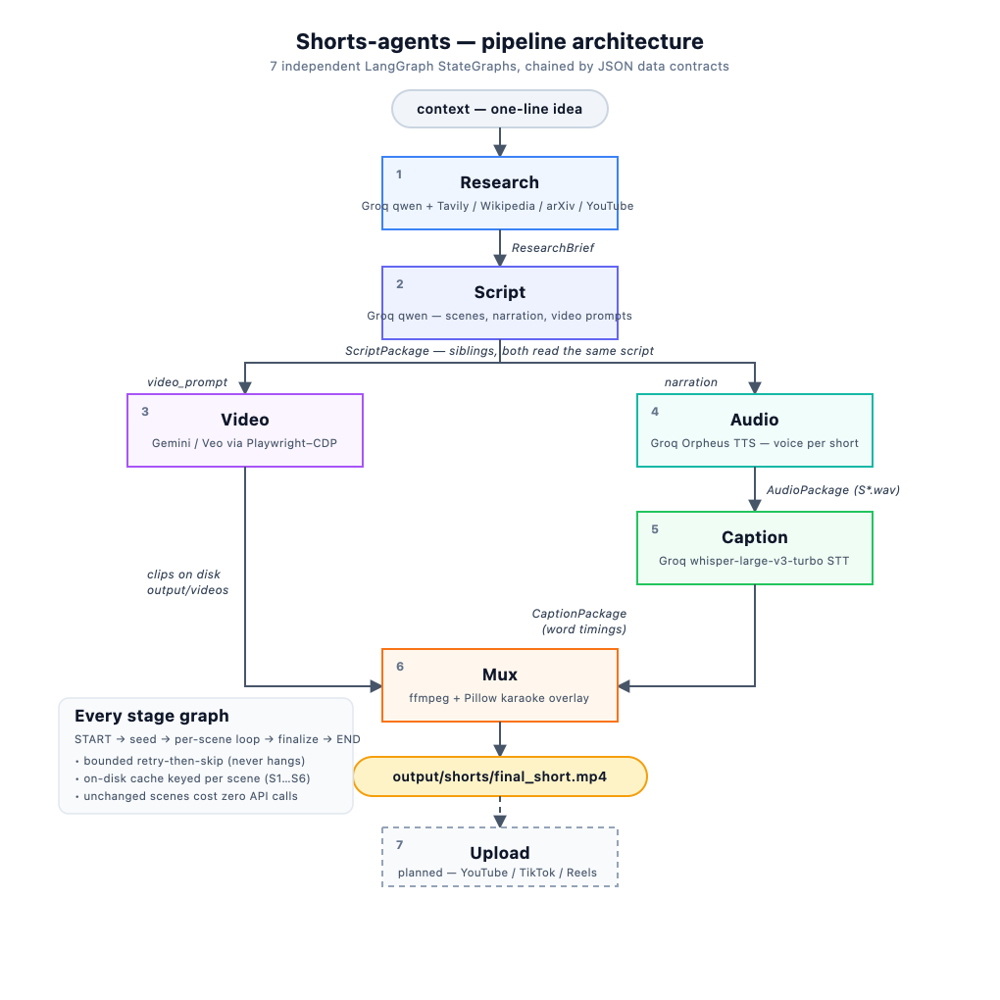

# Shorts-agents

An agentic pipeline that turns a one-line idea into a finished vertical short
(YouTube Shorts / TikTok / Reels). Each stage is an independent
[LangGraph](https://langchain-ai.github.io/langgraph/) `StateGraph`, so stages
can run one at a time for debugging or be chained end-to-end.



<sub>Diagram source: [`docs/architecture.svg`](docs/architecture.svg)</sub>

```
context ──▶ Research ──▶ Script ──┬─▶ Video ─────────────┐
                                  └─▶ Audio ─▶ Caption ─▶ Mux ─▶ final short ─▶ (Upload)
```

The pipeline is deliberately **narration-paced**: the script drives everything,
each scene gets its own generated video clip and voiceover, and the final short
trims every clip to its voiceover length before muxing.

---

## Pipeline stages

| # | Stage | Input | Output | Engine |
|---|-------|-------|--------|--------|
| 1 | **Research** (`research/`) | free-text context | `ResearchBrief` (topic, hooks, facts, hazards, visual cues, tone) | Groq `qwen` + Tavily / Wikipedia / arXiv / YouTube search |
| 2 | **Script** (`script/`) | `ResearchBrief` JSON | `ScriptPackage` (per-scene visual + narration + video prompt, plus a markdown deliverable) | Groq `qwen` |
| 3 | **Video** (`video/`) | `ScriptPackage` JSON | one `S{n}.mp4` clip per scene, 720×1280 portrait | Gemini (Veo) driven via CDP-attached Playwright |
| 4 | **Audio** (`audio/`) | `ScriptPackage` JSON | one `S{n}.wav` voiceover per scene | Groq Orpheus TTS |
| 5 | **Caption** (`caption/`) | `AudioPackage` JSON | word-level timings per scene | Groq `whisper-large-v3-turbo` STT |
| 6 | **Mux** (`mux/`) | `CaptionPackage` JSON | `output/shorts/final_short.mp4` | ffmpeg + Pillow-rendered karaoke captions |
| 7 | **Upload** | _(planned)_ | published short | — |

**Audio is a sibling of Video, not downstream of it** — both consume the
`ScriptPackage` (audio reads each scene's `narration`, video reads its
`video_prompt`). This means the audio → caption → mux tail can be built and
tested without spending any Gemini video quota.

### Shared conventions across every stage

- **Same shape.** Each stage is a `StateGraph(State, input_schema=Input)` with a
  `seed` node that parses the previous stage's JSON, a per-scene loop routed by a
  conditional edge, and a `finalize` node. Each compiles a `graph` and exposes a
  `run_<stage>(json) -> Package` entry point (`recursion_limit` bounded).
- **Bounded retry-then-skip.** No stage hangs on a bad scene. Failures are
  classified, retried a fixed number of times, then the scene is skipped with a
  recorded caveat so the run always completes.
- **On-disk caching.** Every stage writes `output/<stage>/S{n}.<ext>` plus a
  sidecar holding an exact cache key. A rerun reuses a scene only when a freshly
  computed key string-matches the sidecar — so unchanged scenes cost zero API
  calls, and edited scenes regenerate exactly. Cache keys are scoped to the
  generic scene id (`S1`…`S6`), so **switching topics overwrites files** — this
  is intentional (one short in flight at a time).

---

## Setup

### Requirements

- Python **3.11+**
- **ffmpeg / ffprobe** on `PATH` (used by video validation and the mux stage)
- API keys: **Groq** (LLM, TTS, STT) and **Tavily** (research web search)
- Google Chrome + an authenticated Gemini account (only for the Video stage)

> **Note on ffmpeg:** the mux stage assumes an ffmpeg build **without** libass /
> freetype / drawtext (the common Homebrew stripped build). That's why captions
> are rendered as PNG frames by **Pillow** and composited with the `overlay`
> filter rather than burned in with a subtitle filter. If your ffmpeg *does* have
> those, the Pillow path still works unchanged.

### Install

```bash
python3 -m venv venv          # or reuse an existing venv
source venv/bin/activate
pip install -r requirements.txt
playwright install chromium   # only needed for the Video stage

cp .env.example .env          # then fill in GROQ_API_KEY and TAVILY_API_KEY
```

---

## Usage

Run any single stage, piping the previous stage's JSON output in via a file or
stdin. The CLI dispatches on the first argument (`main.py`):

```bash
# Full end-to-end (spends Gemini video quota)
python main.py pipeline context.txt

# One stage at a time — each reads the prior stage's JSON
python main.py research context.txt          > brief.json
python main.py script   brief.json            > script.json
python main.py video    script.json           # writes output/videos/S*.mp4
python main.py audio    script.json           > audio.json      # sibling of video
python main.py caption  audio.json            > caption.json
python main.py mux      caption.json          # writes output/shorts/final_short.mp4
```

- `research` / `script` print their result as JSON / markdown to stdout.
- `video` / `audio` / `caption` / `mux` also write their artifacts under
  `output/` (gitignored).
- The **audio → caption → mux** tail runs entirely on Groq — no Gemini quota.

### Video stage — one-time Gemini auth

Google blocks sign-in inside an automation-controlled browser, so this stage
**attaches** to an already-authenticated Chrome via CDP; it never launches a
browser or drives a login.

1. **Once, by hand** — log in to Gemini in a dedicated profile (no debug port, so
   nothing looks automated):
   ```bash
   open -a "Google Chrome" --args --user-data-dir="$(pwd)/.chrome-profile"
   ```
   Sign in to Gemini normally, then quit Chrome fully.
2. **Before each video run** — relaunch that same profile with the debug port
   open and leave it running:
   ```bash
   open -a "Google Chrome" --args \
       --user-data-dir="$(pwd)/.chrome-profile" \
       --remote-debugging-port=9222
   ```

`video/browser.py` preflight-checks port 9222 and fails fast (~2s) with these
instructions if Chrome isn't reachable. The `.chrome-profile/` and `.auth/`
directories hold live session tokens and are **gitignored** — never commit them.

### LangGraph Studio

Every stage is registered in `langgraph.json`, so you can inspect and step
through any graph individually:

```bash
langgraph dev
```

---

## Project layout

```
common/     shared logging (logs/pipeline.log) and rate-limit retry helpers
research/   stage 1 — brief from context (LLM + search tools)
script/     stage 2 — scenes + narration + per-scene video prompts
video/      stage 3 — Playwright→Gemini clip generation (browser.py)
audio/      stage 4 — Orpheus TTS voiceover (tts.py), model-chosen voice/delivery
caption/    stage 5 — whisper STT word timings (stt.py)
mux/        stage 6 — ffmpeg assembly (encoder.py) + Pillow karaoke (captions.py)
main.py     CLI dispatcher for every stage plus the `pipeline` composite
output/     generated media (gitignored)
```

## Rate limits designed around

- **Groq free tier:** Orpheus TTS 10 RPM / 100 RPD; whisper-turbo 20 RPM / 2K RPD;
  the research LLM account is capped low on input/output tokens-per-minute, so
  tool results are truncated and per-tool call counts are hard-capped.
- **Tavily** is metered (paid credits), so it's structurally capped to 1 call per
  research run; Wikipedia / arXiv / YouTube search are free and preferred first.
- **Gemini** video generation is the scarcest resource — aggressive scene-level
  caching means reruns only regenerate scenes whose prompt actually changed.

## Status

Stages 1–6 are built and verified end-to-end (a 6-scene short renders to
`output/shorts/final_short.mp4`). The **Upload** stage is not yet implemented.
